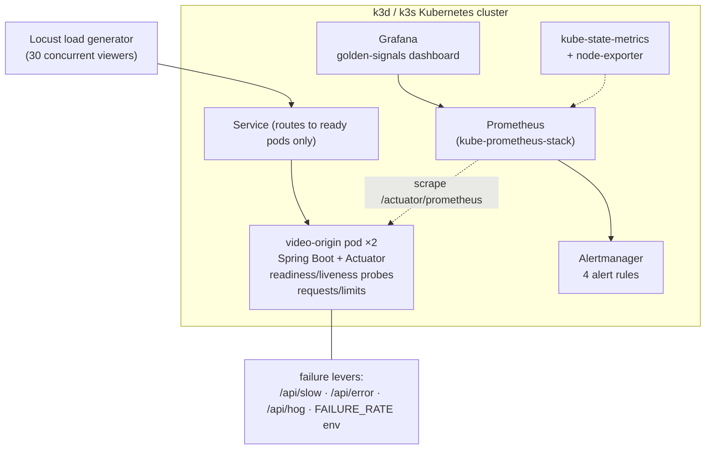

# Video Edge Reliability Stack

A self-hosted SRE lab built the way a real service is run: a video-origin API on
Kubernetes with golden-signal observability, alerting born from incidents, load
testing, and **incident drills with real timelines, runbooks, and postmortems**.

> Built to practise and demonstrate production reliability engineering end-to-end:
> deploy → observe → alert → respond → improve.

## Architecture



**The app ships its own failure levers** (latency injection, probabilistic 5xx,
heap retention, env-driven failure rate) so that every incident drill is reproducible.

## Incident drills (real timelines)

| # | Scenario | Detection | Mitigation | MTTR | Writeup |
|---|---|---|---|---|---|
| 01 | Bad release → 5xx spike on hot path | PromQL 5xx-ratio panel (12.8% and climbing) | `kubectl rollout undo` | **72 s** (detect → recover) | [postmortem](incidents/postmortem-01-bad-release-5xx.md) |
| 02 | Memory-limit misconfig → **OOMKilled (exit 137)** | restarts metric + `describe pod` Last State | restore limits with JVM headroom | minutes | [postmortem](incidents/postmortem-02-oomkilled.md) |

Both drills produced **action items that are now live**: 4 PrometheusRule alerts
(5xx ratio, p95 latency, container restarts, memory-near-limit) — see
[`k8s/alert-rules.yaml`](k8s/alert-rules.yaml). The restart alert genuinely fired
during drill 02. On-call procedures: [runbook](incidents/runbook-video-origin.md).

## Golden-signals dashboard

Grafana dashboard ([`k8s/grafana-dashboard.json`](k8s/grafana-dashboard.json)) tracks:
request rate by status · p95/p99 latency · 5xx error ratio · JVM heap ·
container memory working set vs limit · pod restarts.

## Quickstart (local)

```bash
# prerequisites: Docker, k3d, helm, kubectl
k3d cluster create sre-lab --agents 1
docker build -t video-origin:v1 video-origin/ && k3d image import video-origin:v1 -c sre-lab
kubectl apply -f k8s/video-origin.yaml -f k8s/servicemonitor.yaml -f k8s/alert-rules.yaml
helm install monitoring prometheus-community/kube-prometheus-stack \
  -n monitoring --create-namespace --set grafana.adminPassword=sre-lab
./portforward.sh         # app :8080 · prometheus :9090 · grafana :3000
curl -s -u admin:sre-lab -H "Content-Type: application/json" \
  -X POST localhost:3000/api/dashboards/db -d @k8s/grafana-dashboard.json

# traffic
python3 -m locust -f loadtest/locustfile.py --headless -u 30 -r 5 -t 30m --host http://localhost:8080

# re-run incident drill 01 (bad release → watch 5xx → roll back)
kubectl patch deployment video-origin --type=json -p='[
 {"op":"replace","path":"/spec/template/spec/containers/0/image","value":"video-origin:v2"},
 {"op":"add","path":"/spec/template/spec/containers/0/env","value":[{"name":"FAILURE_RATE","value":"0.4"}]}]'
kubectl rollout undo deployment/video-origin   # the fix
```

## Repository layout

```
video-origin/   Spring Boot origin API + multi-stage Dockerfile
k8s/            Deployment/Service (probes, limits), ServiceMonitor,
                alert rules, Grafana dashboard JSON
loadtest/       Locust viewer-behaviour profile
incidents/      runbook + postmortems (real timelines)
docs/           learning notes (SRE fundamentals mapped to this lab)
infra/          Terraform: AWS EC2 + k3s cloud deployment (in progress)
```

## Roadmap

- [x] v1 — local k3d: app, observability, alerts, load, 2 incident drills
- [ ] v2 — Nginx edge-cache layer in front of origin (cache-hit-ratio panels, cache-miss incident drill)
- [ ] cloud — Terraform-provisioned EC2 + k3s, public read-only Grafana, uptime/SLO tracking (99% target), weekly failure drills
